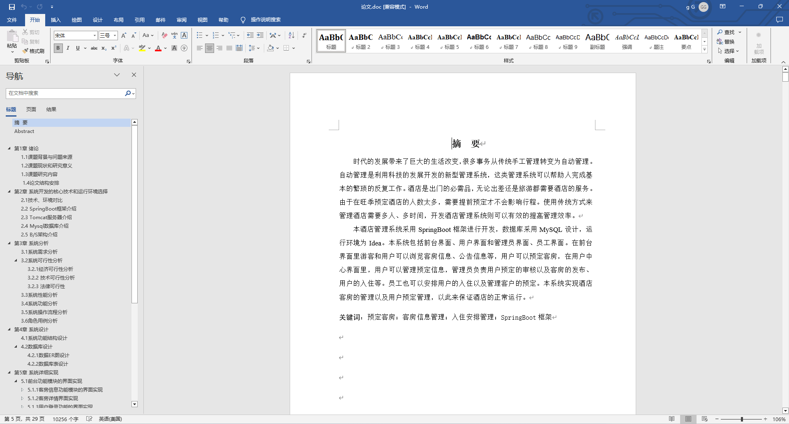
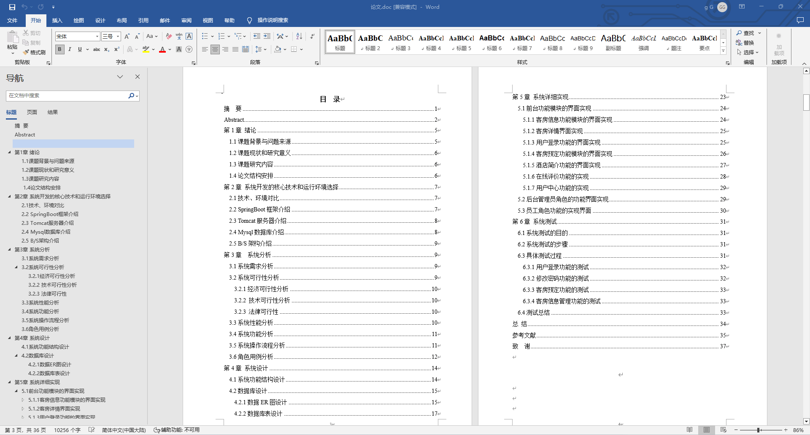
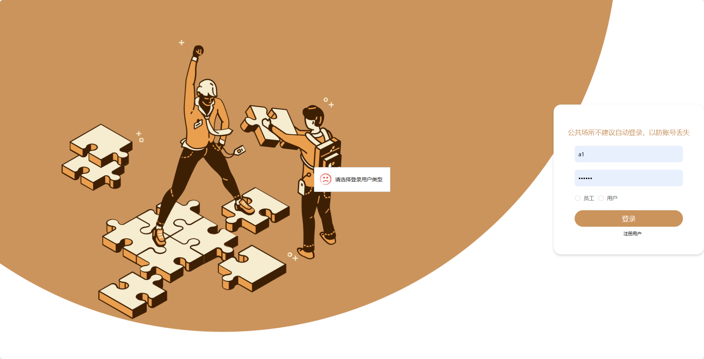
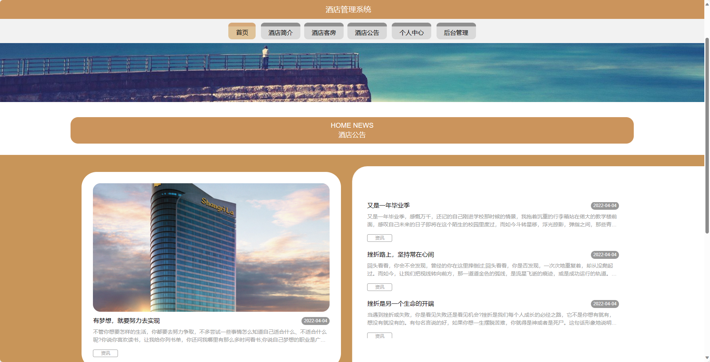
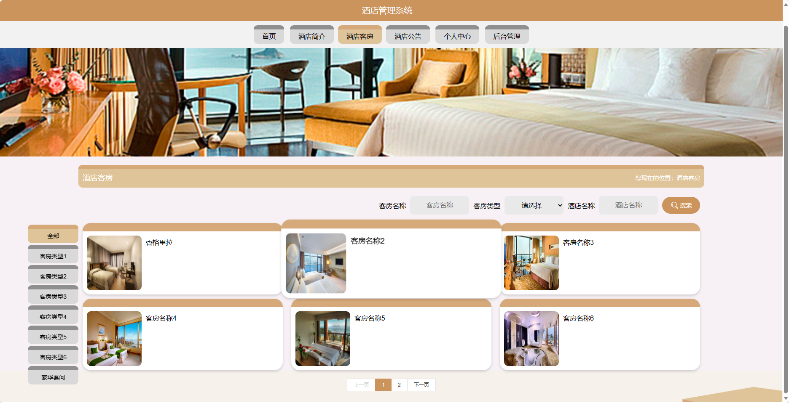
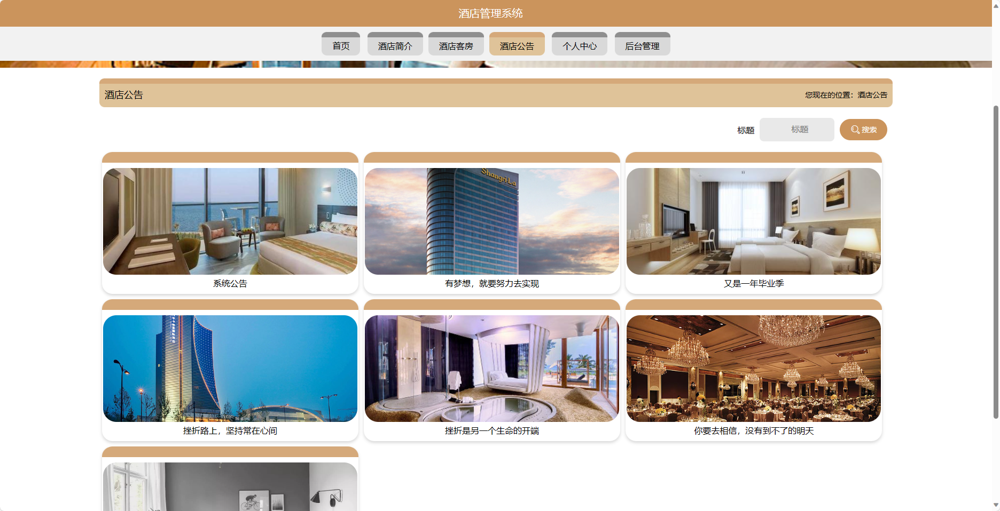
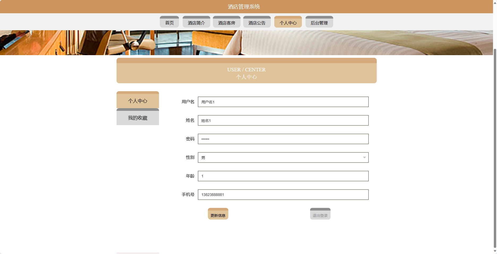
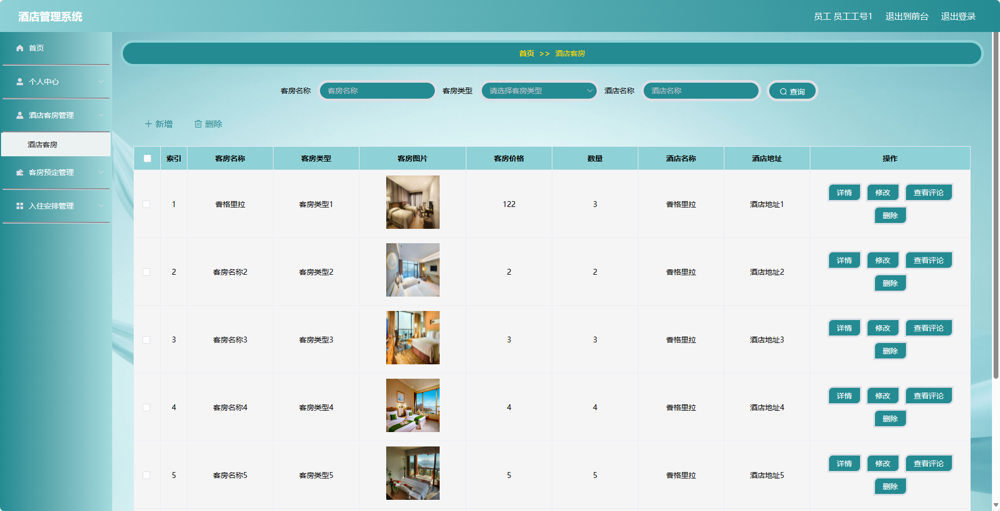
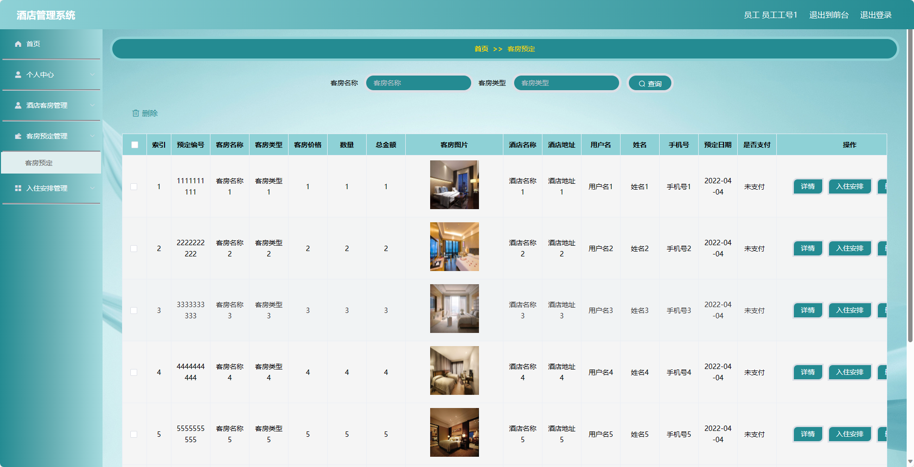
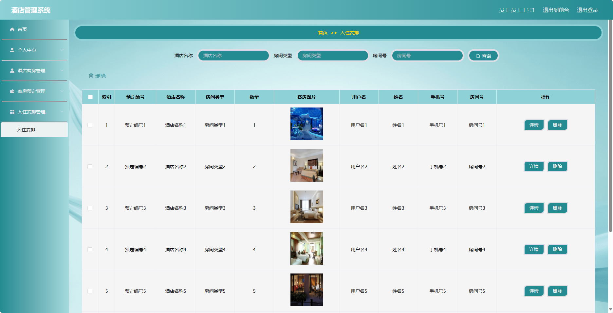

基于SpringBoot的酒店管理系统（程序+论文）
=
- 完整代码获取地址：从戎源码网 ([https://armycodes.com/](https://armycodes.com/))
- 作者微信：19941326836  QQ：952045282 
- 承接计算机毕业设计、Java毕业设计、Python毕业设计、深度学习、机器学习
- 选题+开题报告+任务书+程序定制+安装调试+论文+答辩ppt 一条龙服务
- 所有选题地址https://github.com/nature924/allProject

一、项目介绍
---
基于Spring Boot框架实现的酒店管理系统，系统包含两种角色：管理员、用户,系统分为前台和后台两大模块，主要功能如下。
### 前台：
- 首页：展示酒店的一些基本信息和轮播图。
- 酒店简介：展示酒店的基本介绍、位置等信息。
- 酒店客房：用户可以查看酒店的客房类型、价格、设施等信息，并进行客房预定。
- 酒店公告：展示酒店的公告信息，包括优惠活动、服务通知等。
- 个人中心：管理个人信息，包括修改个人信息、查看订单记录等。

### 后台：
- 管理员：
    - 个人中心：管理个人信息，包括修改个人信息、查看订单记录等。
    - 员工管理：管理酒店的员工信息，包括添加、编辑、删除员工等操作。
    - 用户管理：管理酒店的用户信息，包括添加、编辑、删除用户等操作。
    - 客房类型管理：管理酒店的客房类型信息，包括添加、编辑、删除客房类型等操作。
    - 酒店简介管理：管理酒店的简介信息，包括编辑、更新酒店简介等操作。
    - 酒店客房管理：管理酒店的客房信息，包括添加、编辑、删除客房等操作。
    - 客房预定管理：管理客房的预定信息，包括查看、确认、取消预定等操作。
    - 入住安排管理：管理客房的入住安排，包括分配客房、修改入住信息等操作。
    - 系统管理：管理系统的基础数据，包括轮播图信息、通知公告等。

- 员工：
    - 个人中心：管理个人信息，包括修改个人信息、查看订单记录等。
    - 酒店客房管理：管理酒店的客房信息，包括添加、编辑、删除客房等操作。
    - 客房预定管理：管理客房的预定信息，包括查看、确认、取消预定等操作。
    - 入住安排管理：管理客房的入住安排，包括分配客房、修改入住信息等操作。

二、项目技术
---
- 编程语言：Java
- 数据库：MySQL
- 项目管理工具：Maven
- 前端技术：VUE、HTML、Jquery、Bootstrap
- 后端技术：Spring、SpringMVC、MyBatis

三、运行环境
---
- 操作系统：Windows、macOS都可以
- JDK版本：JDK1.8以上都可以
- 开发工具：IDEA、Ecplise、Myecplise都可以
- 数据库: MySQL5.7以上都可以
- Tomcat：任意版本都可以
- Maven：任意版本都可以

四、运行截图
---
### 论文截图：

### 程序截图：

